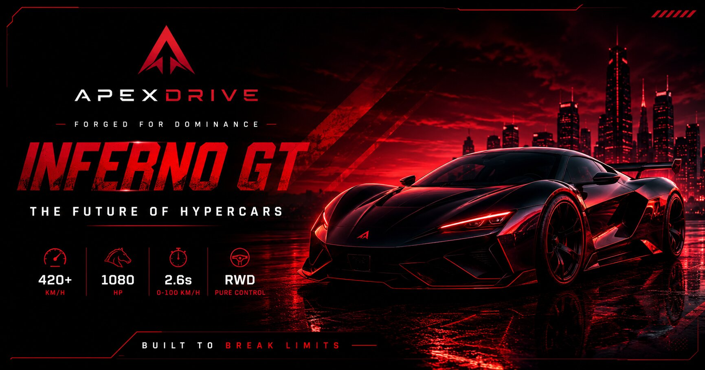

# 🚗 ApexDrive

ApexDrive is a premium futuristic hypercar showcase web experience designed to deliver cinematic visuals, immersive interactions, and luxury automotive branding.

Built as a high-end frontend project, ApexDrive focuses on storytelling through motion, premium UI design, and engaging interactive elements.

## ✨ Features

- Cinematic hypercar landing experience
- Premium futuristic UI design
- Interactive car configurator
- Dynamic color customization
- Live speedometer animation
- Engine startup interaction
- Luxury gallery showcase
- Smooth scroll animations
- Fully responsive layout
- Premium sound effects
- Interactive user experience

## 🛠 Tech Stack

- HTML5
- CSS3
- JavaScript
- Responsive Design
- GitHub Pages Deployment

## 🌐 Live Demo

🔗 https://ayushrajfrontend.github.io/ApexDrive/

## 📸 Preview

## 🎯 Project Purpose

ApexDrive was created to showcase advanced frontend development skills through a visually immersive premium automotive experience.

The project focuses on combining cinematic design, interactivity, modern frontend animations, and storytelling-driven UI.

## 🚀 Highlights

- Premium luxury branding
- Cinematic frontend storytelling
- Advanced animations
- Interactive configurator
- Responsive premium layout
- High visual polish
- Immersive user experience

## 📂 Source Code

GitHub Repository:  
https://github.com/AyushRajFrontend/ApexDrive

## 👨‍💻 Author

**Ayush Raj**

Frontend Developer focused on premium digital experiences.

Portfolio:  
https://ayushrajfrontend.github.io/ayush-portfolio/
